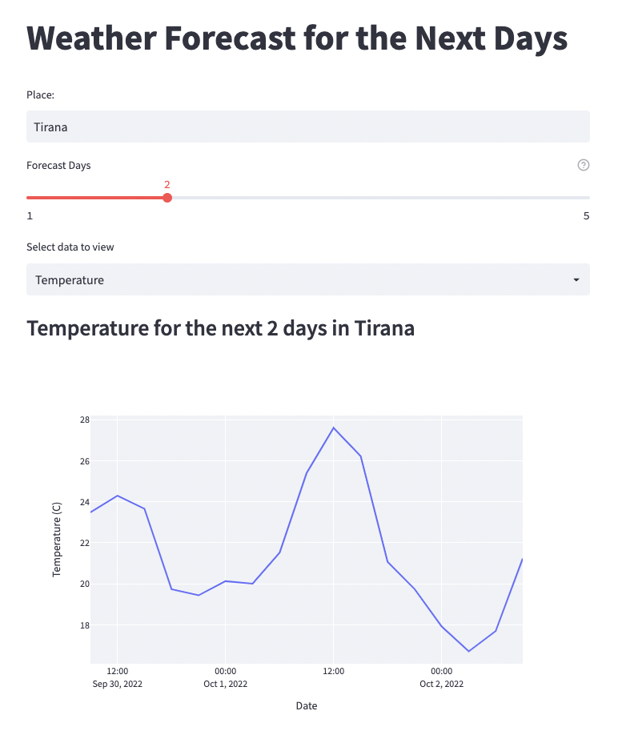

# Weather Forecast Data App

This is a simple weather forecast data application built with Streamlit and Plotly. It fetches weather data from the OpenWeatherMap API and displays temperature and sky conditions for the next few days.

## Project Structure

```
App-Design.png
backend.py
main.py
__pycache__/
    backend.cpython-313.pyc
images/
    clear.png
    cloud.png
    rain.png
    snow.png
```

## Requirements

- Python 3.7+
- Streamlit
- Plotly
- Requests

## Installation

1. Clone the repository:
    ```sh
    git clone https://github.com/Nibir2405/weather_forcast_data_app.git
    cd weather_forecast_data_app
    ```

2. Install the required packages:
    ```sh
    pip install -r requirements.txt
    ```

3. Create a `requirements.txt` file with the following content:
    ```txt
    streamlit
    plotly
    requests
    ```

## Usage

1. Run the Streamlit app:
    ```sh
    streamlit run main.py
    ```

2. Open your web browser and go to `http://localhost:8501`.

3. Enter the place name, select the number of forecast days, and choose the data to view (Temperature or Sky).

## Files

- `main.py`: The main Streamlit application file.
- `backend.py`: Contains the function to fetch weather data from the OpenWeatherMap API.
- `images/`: Contains images for different sky conditions.

## Example



## License

This project is licensed under the MIT License. See the [LICENSE](LICENSE) file for details.